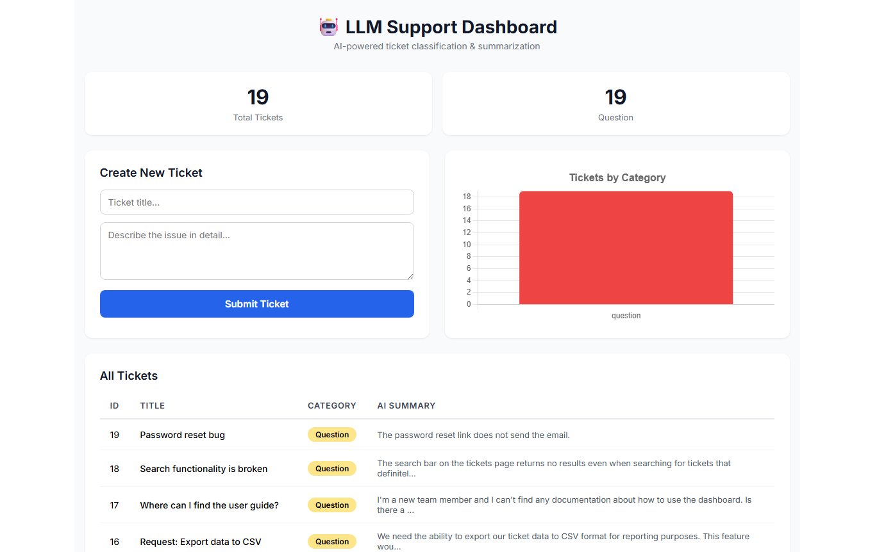
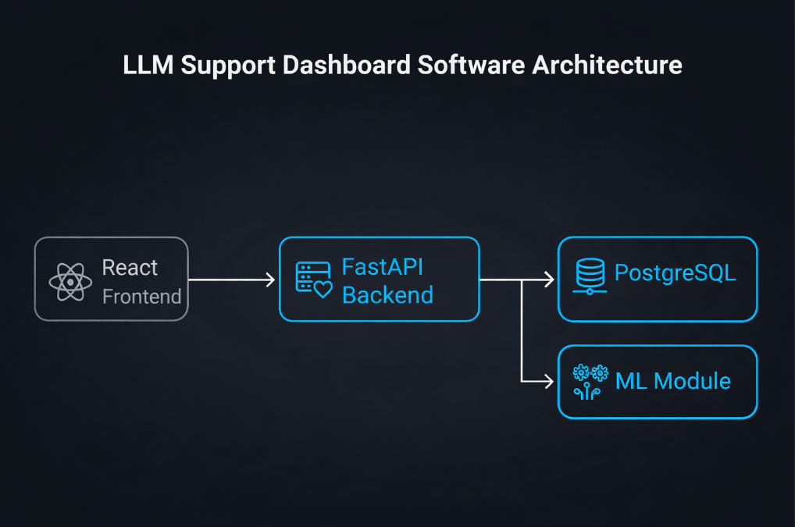

# LLM Support Dashboard

A full-stack project for creating support tickets, storing them in a database, and showing simple analytics in a dashboard.

## Overview

This project uses a FastAPI backend, PostgreSQL database, and React frontend. Users can create tickets, view saved tickets, and see basic ticket metrics in the dashboard.

## Project Preview




## Features

- Create support tickets
- Store tickets in PostgreSQL
- View all tickets in a dashboard
- Show ticket counts by category
- Display short ticket summaries
- Visualize ticket data with a chart

## Tech Stack

- Python
- FastAPI
- SQLAlchemy
- PostgreSQL
- React
- Vite
- Chart.js
- Docker

## How It Works

The frontend sends requests to the FastAPI backend.  
The backend stores ticket data in PostgreSQL.  
The dashboard reads ticket data from the backend and shows it in a table and chart.  
The project also includes a simple ML file structure for ticket classification and summarization.

## Architecture




A simple flow is:

`React frontend -> FastAPI backend -> PostgreSQL database`

# How to Run 
Open a new PowerShell:

cd C:\Users\Jerem\Downloads\llm-support-dashboard\backend
$env:USE_REAL_MODELS="false"
.\venv\Scripts\python.exe -m uvicorn main:app --reload --port 8000

Open:

http://localhost:8000/docs

3. Start the frontend

Open a new PowerShell:

cd C:\Users\Jerem\Downloads\llm-support-dashboard\frontend
$env:Path += ";C:\Program Files\nodejs"
& "C:\Program Files\nodejs\npm.cmd" run dev

Then open the local Vite link shown in the terminal.

4. Seed sample tickets

Open a new PowerShell:

cd C:\Users\Jerem\Downloads\llm-support-dashboard\backend
.\venv\Scripts\python.exe seed_tickets.py

# What to Check
The dashboard opens in the browser
The ticket form works
The table shows saved tickets
The chart displays ticket counts
FastAPI docs open at http://localhost:8000/docs
# Main Local Links
Frontend: http://localhost:3000
If port 3000 is busy, use the Vite link shown in the terminal
Backend docs: http://localhost:8000/docs
Tickets JSON: http://localhost:8000/tickets
Metrics JSON: http://localhost:8000/metrics/tickets

## Project Structure

```text
llm-support-dashboard/
├── backend/
│   ├── main.py
│   ├── database.py
│   ├── models.py
│   ├── schemas.py
│   ├── ml.py
│   ├── seed_tickets.py
│   ├── requirements.txt
│   └── Dockerfile
├── frontend/
│   ├── src/
│   │   ├── App.jsx
│   │   └── main.jsx
│   ├── index.html
│   ├── package.json
│   ├── vite.config.js
│   └── Dockerfile
├── docker-compose.yml
└── README.md